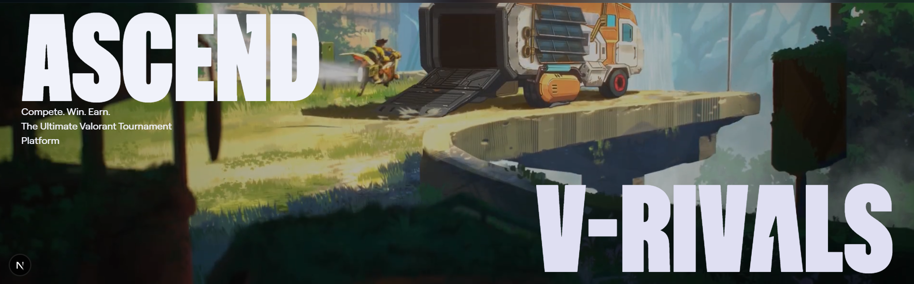

# 🎮 V-RIVALS — The Next-Gen Valorant Esports Platform



**V-RIVALS** is an award-winning, high-performance competitive platform engineered specifically for the _Valorant_ community. It bridges the gap between casual matchmaking and professional esports by offering a unified ecosystem for tournaments, player scouting, statistical analysis, and community building.

Built with an ultramodern tech stack featuring **Next.js 15**, **Tailwind CSS 4**, and **Appwrite**, V-RIVALS delivers a pixel-perfect, responsive, and blazing-fast experience. It integrates directly with Riot Games' data (via unofficial APIs) to provide real-time stats, rank verification, and live match tracking.

---

## 🛠️ Technology Stack


---

## ✨ Features at a Glance

### 🏆 Advanced Tournament Engine

The platform supports multiple competitive formats with professional-grade management tools.

- **Game Modes**: Support for **Standard 5v5**, **Deathmatch** (FFA), and **Skirmish** modes (1v1, 2v2, 3v3).
- **Automated Brackets**: Dynamic single-elimination bracket generation that updates in real-time as matches conclude.
- **Match Lobbies**: Dedicated match rooms for every pairing, featuring:
  - **Map Veto System**: Interactive map banning phase for 5v5 matches.
  - **Map Lottery**: CS:GO Case-style map randomization animation for Skirmish modes.
  - **Live Chat**: Real-time communication between teams and admins.
  - **Quick Import**: Admins can fetch match results directly from Valorant API to auto-fill scores and stats.

### 🤖 Deep Discord Integration

Seamlessly connected with your community Discord server.

- **Verification Bot**: Links Discord accounts to V-RIVALS profiles to verify identity.
- **Automated Channels**: Automatically creates private text and voice channels for each tournament match.
- **Role Management**: Assigns roles to registered captains and players automatically.
- **Live Notifications**: Broadcasts tournament creates, match results, and scouting reports directly to Discord channels.

### 🔍 Scouting & Player Finder

A sophisticated discovery engine to help teams find the perfect roster fit.

- **Smart Filtering**: Filter free agents by **Role** (Duelist, Controller, etc.), **Region** (AP, NA, EU), **Rank** (Radiant to Iron), and **Agent Pool**.
- **Intelligence Score**: A proprietary algorithm that calculates a player's "Intelligence Score" based on their rank, win rate, and recent performance.
- **Scouting Reports**: Players can post "Scouting Reports" (LFT posts) which are broadcasted to the Discord server.

### 👤 Pro-Grade Profiles

Your digital resume for the competitive scene.

- **Riot Sync**: One-click integration key stats directly from Valorant (Rank, Headshot %, K/D).
- **Career Timeline**: Visual history of recent matches with detailed performance breakdowns (ACS, ADR, Clutches).
- **Rank Intelligence**: Visualizations of MMR progress and rank distribution.
- **Leaderboards**: Global and regional leaderboards tracking earnings and tournament wins.

### 🛡️ Admin Command Center

A powerful dashboard for ecosystem managers.

- **Tournament Control**: Create, edit, and delete tournaments. Force-advance brackets and resolve disputes.
- **User Management**: Inspect user profiles, ban/suspend users, and manage permissions.
- **Discord Controls**: Manually sync or delete tournament-associated Discord channels.

---

## 📁 Project Structure

```bash
src/
├── app/                  # Next.js 15 App Router
│   ├── (admin)/          # Protected Admin Dashboard routes
│   │   ├── admin/tournaments/[id]/ # Deep tournament management
│   │   └── ...
│   ├── (main)/           # Public facing pages
│   │   ├── tournaments/  # List & Detail views for tournaments
│   │   ├── profile/      # User Profile & Stats
│   │   └── match/        # Live Match Lobby & Veto Interface
│   ├── api/              # API Routes (Discord Webhooks, Auth callbacks)
│   └── globals.css       # Tailwind 4 & Global Styles
├── components/           # Reusable UI Library
│   ├── match/            # Match-specific components (MapLottery, VetoBoard)
│   ├── admin/            # Admin forms (MatchEditor, BracketView)
│   └── ...               # Generic UI (Buttons, Modals, Loaders)
├── lib/                  # Core Business Logic
│   ├── appwrite.js       # Appwrite SDK Config
│   ├── brackets.js       # Bracket generation & advancement logic
│   ├── discord.js        # Discord Bot interactions
│   └── valorant.js       # Game API wrappers
└── context/              # React Context Providers (AuthContext)
```

---

## 🚀 Installation & Setup

### 1. Prerequisites

- **Node.js** (v18.17.0 or better)
- **Appwrite Instance**: You need a running Appwrite instance (Cloud or Self-Hosted).
- **Discord Application**: Create a bot in the [Discord Developer Portal](https://discord.com/developers/applications).

### 2. Clone the Repository

```bash
git clone https://github.com/leonardoo210399/V-Rivels.git
cd V-Rivels/frontend
```

### 3. Install Dependencies

```bash
npm install
# or
yarn install
```

### 4. Environment Configuration

The application relies on several environment variables for Appwrite, Valorant Data, and Discord integration. Create a `.env` or `.env.local` file in the root of `frontend/`.

#### CORE: Appwrite Configuration

These keys connect the frontend to your Appwrite backend.
| Variable | Description | How to get it |
| :--- | :--- | :--- |
| `NEXT_PUBLIC_APPWRITE_ENDPOINT` | Appwrite API Endpoint | Appwrite Console -> Settings |
| `NEXT_PUBLIC_APPWRITE_PROJECT_ID` | Project ID | Appwrite Console -> Overview (Top Left) |
| `NEXT_PUBLIC_APPWRITE_PROJECT_NAME` | Project Name | Appwrite Console -> Settings |
| `NEXT_PUBLIC_APPWRITE_DATABASE_ID` | Database ID | Appwrite Console -> Databases -> ID |
| `APPWRITE_API_KEY` | Server-side Admin Key | Appwrite Console -> Overview -> API Keys (Scopes: users, database, functions) |

#### DATABASE: Collection IDs

Specific IDs for your Appwrite Collections.
| Variable | Description | How to get it |
| :--- | :--- | :--- |
| `NEXT_PUBLIC_APPWRITE_TOURNAMENTS_COLLECTION_ID` | Tournaments Collection | Database -> Tournaments -> Settings |
| `NEXT_PUBLIC_APPWRITE_REGISTRATIONS_COLLECTION_ID` | Registrations Collection | Database -> Registrations -> Settings |
| `NEXT_PUBLIC_APPWRITE_MATCHES_COLLECTION_ID` | Matches Collection | Database -> Matches -> Settings |
| `NEXT_PUBLIC_APPWRITE_FREE_AGENTS_COLLECTION_ID` | Player Finder Collection | Database -> Free Agents -> Settings |
| `NEXT_PUBLIC_APPWRITE_SUPPORT_TICKETS_COLLECTION_ID` | Support/Help Collection | Database -> Support Tickets -> Settings |

#### GAME DATA: Valorant API

Keys for the unofficial HenrikDev API to fetch player ranks and matches.
| Variable | Description | How to get it |
| :--- | :--- | :--- |
| `VALORANT_API_KEYS` | Comma-separated list of API keys | [HenrikDev Portal](https://api.henrikdev.xyz/) (Generate multiple for rate limit rotation) |

#### INTEGRATIONS: Discord Bot

Required for automated channel creation and innovative notification features.
| Variable | Description | How to get it |
| :--- | :--- | :--- |
| `DISCORD_BOT_TOKEN` | Bot Token | [Discord Developer Portal](https://discord.com/developers/applications) -> Bot -> Token |
| `DISCORD_ANNOUNCEMENTS_CHANNEL_ID` | Channel for major updates | Enable Dev Mode -> Right Click Channel -> Copy ID |
| `DISCORD_TOURNAMENT_INFO_CHANNEL_ID` | Channel for tournament logs | Right Click Channel -> Copy ID |
| `DISCORD_PLAYER_FINDER_CHANNEL_ID` | Channel for scouting posts | Right Click Channel -> Copy ID |
| `DISCORD_RESULTS_CHANNEL_ID` | Channel for match results | Right Click Channel -> Copy ID |
| `DISCORD_REGISTRATIONS_CHANNEL_ID` | Channel for new team signups | Right Click Channel -> Copy ID |

#### SYSTEM: Base URLs

| Variable               | Description                | Example                                          |
| :--------------------- | :------------------------- | :----------------------------------------------- |
| `NEXT_PUBLIC_SITE_URL` | Public URL of the frontend | `http://localhost:3000` or `https://vrivals.com` |
| `APP_BASE_URL`         | Internal Server URL        | `http://localhost:3000` or `https://vrivals.com` |

```env
# EXAMPLE .env FILE

# Core Appwrite
NEXT_PUBLIC_APPWRITE_ENDPOINT=https://cloud.appwrite.io/v1
NEXT_PUBLIC_APPWRITE_PROJECT_ID=65abcd1234
NEXT_PUBLIC_APPWRITE_PROJECT_NAME=V-RIVALS
NEXT_PUBLIC_APPWRITE_DATABASE_ID=65dbcd5678
APPWRITE_API_KEY=your_secret_admin_key_here

# Collections
NEXT_PUBLIC_APPWRITE_TOURNAMENTS_COLLECTION_ID=tournaments
NEXT_PUBLIC_APPWRITE_REGISTRATIONS_COLLECTION_ID=registrations
NEXT_PUBLIC_APPWRITE_MATCHES_COLLECTION_ID=matches
NEXT_PUBLIC_APPWRITE_FREE_AGENTS_COLLECTION_ID=free_agents
NEXT_PUBLIC_APPWRITE_SUPPORT_TICKETS_COLLECTION_ID=support_tickets

# Valorant Data
VALORANT_API_KEYS=key1,key2,key3

# Discord
DISCORD_BOT_TOKEN=OTk5...
DISCORD_ANNOUNCEMENTS_CHANNEL_ID=123456789
DISCORD_TOURNAMENT_INFO_CHANNEL_ID=123456789
DISCORD_PLAYER_FINDER_CHANNEL_ID=123456789
DISCORD_RESULTS_CHANNEL_ID=123456789
DISCORD_REGISTRATIONS_CHANNEL_ID=123456789

# System
NEXT_PUBLIC_SITE_URL=http://localhost:3000
APP_BASE_URL=http://localhost:3000
```

#### DATABASE: Schema Setup

> [!TIP]
> This project includes an `appwrite.config.json` file properly defining all Collections (Users, Tournaments, Matches, etc.) and their Attributes.
> You can reference this file to manually create your Appwrite Database structure, or use the Appwrite CLI to deploy it directly.

### 5. Start Development Server

```bash
npm run dev
```

Visit [http://localhost:3000](http://localhost:3000) to see the application.

### 7. Feature Gallery


> _Experience the next generation of esports management with 3D Map Vetoes, Live Brackets, and Real-time Discord Updates._

V-RIVALS is optimized for Vercel. Since the **Discord Bot** runs via **Serverless Actions** (spinning up per-request), you do **not** need a separate worker process for the bot. It works out of the box!

> [!IMPORTANT]
> **Prerequisites Required!**
> The button below handles code deployment and configuration, but it **cannot create your database**.
> You MUST have your own **Appwrite Instance** (Cloud or Self-Hosted) and **Discord Application** created beforehand to populate the environment variables during setup.

<a href="https://vercel.com/new/clone?repository-url=https%3A%2F%2Fgithub.com%2Fleonardoo210399%2FV-Rivels&env=NEXT_PUBLIC_APPWRITE_ENDPOINT,NEXT_PUBLIC_APPWRITE_PROJECT_ID,APPWRITE_API_KEY,DISCORD_BOT_TOKEN,NEXT_PUBLIC_APPWRITE_DATABASE_ID,NEXT_PUBLIC_APPWRITE_TOURNAMENTS_COLLECTION_ID,NEXT_PUBLIC_APPWRITE_REGISTRATIONS_COLLECTION_ID,NEXT_PUBLIC_APPWRITE_MATCHES_COLLECTION_ID,NEXT_PUBLIC_APPWRITE_FREE_AGENTS_COLLECTION_ID,NEXT_PUBLIC_APPWRITE_SUPPORT_TICKETS_COLLECTION_ID"></a>

---

## 📦 Game Modes Detail

V-RIVALS supports diverse competitive formats suited for different player counts:

### 5v5 Standard

- **Format**: Competitive Standard.
- **Features**: Full Map Veto capabilities, Coin Toss integration, and Captain-priority check-ins.
- **Roster**: Supports 5 main players + subs.

### Deathmatch (FFA)

- **Format**: High-score wins.
- **Features**: Automated score aggregation across multiple maps.
- **Limit**: Up to 40 players per lobby.

### Skirmish (1v1 / 2v2 / 3v3)

- **Format**: Fast-paced elimination.
- **Features**:
  - **Map Lottery**: A unique visual selector that randomly chooses the map.
  - **Quick Brackets**: smaller bracket sizes (8-16 teams) for quick daily cups.

---

## 🤝 Contributing

We welcome contributions to make V-RIVALS better!

1. **Fork** the repository.
2. Create a **Feature Branch** (`git checkout -b feature/NewThing`).
3. Commit your changes.
4. Push to the branch.
5. Open a **Pull Request**.

---

## 📄 License

Distributed under the **[MIT License](./LICENSE)**. See `LICENSE` for more information.

---

_Designed & Developed by **Aditya** (aka **Leonardoo210399**)_
